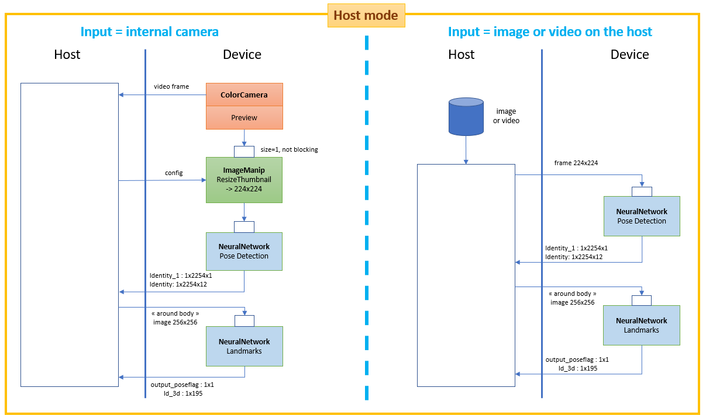
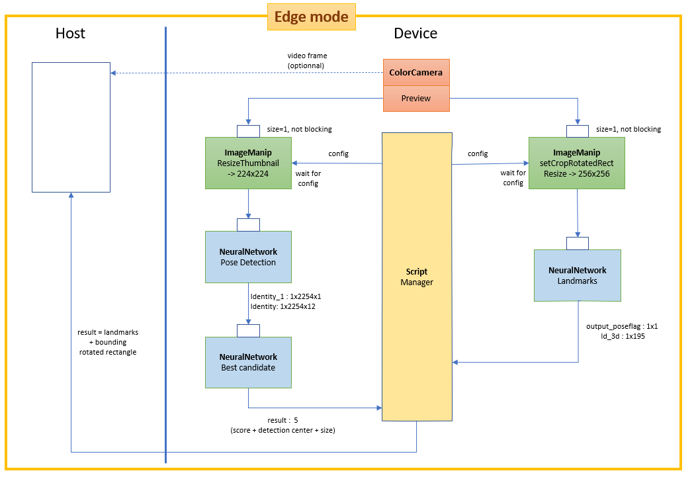

# Blazepose tracking with DepthAI

Running Google Mediapipe body pose tracking models on [DepthAI](https://docs.luxonis.com/en/gen2/) hardware (OAK-1, OAK-D, ...). **Updated with the models "full" and "lite" of mediapipe 0.8.4 2021/05** ("heavy" is unusable on MYRIADX). The previous version of landmark model from mediapipe 0.8.3.1 has been kept as it offers an intermediate speed between the new "full" and "lite" models.

For the competitor Movenet on DepthAI, please visit : [depthai_movenet](https://github.com/geaxgx/depthai_movenet)

For an OpenVINO version of Blazepose, please visit : [openvino_blazepose](https://github.com/geaxgx/openvino_blazepose)


## Architecture: Host mode vs Edge mode



## Install

**Currently, the scripting node capabilty is an alpha release. It is important to use the version specified in the requirements.txt**

Install the python packages DepthAI, Opencv, open3d with the following command:

```python3 -m pip install -r requirements.txt```

## Run

**Usage:**

```
> python demo.py -h
usage: demo.py [-h] [-e] [-i INPUT] [--pd_m PD_M] [--lm_m LM_M] [-c]
               [--no_smoothing] [--filter_window_size FILTER_WINDOW_SIZE]
               [--filter_velocity_scale FILTER_VELOCITY_SCALE]
               [-f INTERNAL_FPS]
               [--internal_frame_height INTERNAL_FRAME_HEIGHT] [-s] [-t]
               [--force_detection] [-3] [-o OUTPUT]

optional arguments:
  -h, --help            show this help message and exit
  -e, --edge            Use Edge mode (postprocessing runs on the device)
  -i INPUT, --input INPUT
                        'rgb' or 'rgb_laconic' or path to video/image file to
                        use as input (default=rgb)
  --pd_m PD_M           Path to an .blob file for pose detection model
  --lm_m LM_M           Landmark model ('full' or 'lite' or '831') or path to
                        an .blob file (default=None)
  -c, --crop            Center crop frames to a square shape before feeding
                        pose detection model
  --no_smoothing        Disable smoothing filter
  --filter_window_size FILTER_WINDOW_SIZE
                        Smoothing filter window size. Higher value adds to lag
                        and to stability (default=5)
  --filter_velocity_scale FILTER_VELOCITY_SCALE
                        Smoothing filter velocity scale. Lower value adds to
                        lag and to stability (default=10)
  -f INTERNAL_FPS, --internal_fps INTERNAL_FPS
                        Fps of internal color camera. Too high value lower NN
                        fps (default= depends on the model)
  --internal_frame_height INTERNAL_FRAME_HEIGHT
                        Internal color camera frame height in pixels
                        (default=640)
  -s, --stats           Print some statistics at exit
  -t, --trace           Print some debug messages
  --force_detection     Force person detection on every frame (never use
                        landmarks from previous frame to determine ROI)
  -3, --show_3d         Display skeleton in 3d in a separate window (valid
                        only for full body landmark model)
  -o OUTPUT, --output OUTPUT
                        Path to output video file
```
**Examples :**

- To use default internal color camera as input with the model "full" in Host mode:

    ```python3 demo.py```

- To use default internal color camera as input with the model "full" in Edge mode:

    ```python3 demo.py -e```

- To use a file (video or image) as input :

    ```python3 demo.py -i filename```

- To use the model "lite" :

    ```python3 demo.py -lm_m lite```

- To show the skeleton in 3D (note that it will lower the FPS):

    ```python3 demo.py -3```

- When using the internal camera, to change its FPS to 15 : 

    ```python3 demo.py --internal_fps 15```

    Note: by default, the default internal camera FPS depends on the model. These default values are based on my own observations. **Please, don't hesitate to play with this parameter to find the optimal value.** If you observe that your FPS is well below the default value, you should lower the FPS with this option until the set FPS is just above the observed FPS.

- When using the internal camera, you may not need to work with the full resolution. You can work with a lower resolution (and win a bit of FPS) by using this option: 

    ```python3 demo.py --internal_frame_size 450```

    Note: currently, depthai supports only some possible values for this argument. The value you specify will be replaced by the closest possible value (here 432 instead of 450).

- By default, a temporal filter smoothes the landmark positions. You can tune the smoothing with the arguments *--filter_window_size* and *--filter_velocity_scale*. Use *--no_smoothing* to disable the filter.

|Keypress|Function|
|-|-|
|*Esc*|Exit|
|*space*|Pause|
|r|Show/hide the bounding rotated rectangle around the body|
|f|Show/hide FPS|


## The models 
You can directly find the model files (.xml and .bin) under the 'models' directory. Below I describe how to get the files in case you need to regenerate the models.

1) Clone this github repository in a local directory (DEST_DIR)
2) In DEST_DIR/models directory, download the source tflite models from Mediapipe:
* [Pose detection model](https://github.com/google/mediapipe/blob/master/mediapipe/modules/pose_detection/pose_detection.tflite)
* [Full pose landmark model](https://github.com/google/mediapipe/tree/master/mediapipe/modules/pose_landmark/pose_landmark_full.tflite)
* [Lite body pose landmark model](https://github.com/google/mediapipe/tree/master/mediapipe/modules/pose_landmark/pose_landmark_lite.tflite)

Note that Mediapipe is also publishing an "Heavy" version of the model but [this version, after conversion, in FP16 is unusable on MYRIADX](https://github.com/PINTO0309/tflite2tensorflow/issues/9).
3) Install the amazing [PINTO's tflite2tensorflow tool](https://github.com/PINTO0309/tflite2tensorflow). Use the docker installation which includes many packages including a recent version of Openvino.
3) From DEST_DIR, run the tflite2tensorflow container:  ```./docker_tflite2tensorflow.sh```
4) From the running container: 
```
cd workdir/models
./convert_models.sh
```
The *convert_models.sh* converts the tflite models in tensorflow (.pb), then converts the pb file into Openvino IR format (.xml and .bin), and finally converts the IR files in MyriadX format (.blob).

By default, the number of SHAVES associated with the blob files is 4. In case you want to generate new blobs with different number of shaves, you can use the script *gen_blob_shave.sh*:
```
# Example: to generate blobs for 6 shaves
./gen_blob_shave.sh -m pd -n 6        # will generate pose_detection_sh6.blob
./gen_blob_shave.sh -m lm_full -n 6   # will generate pose_landmark_full_body_sh6.blob
```


**Explanation about the Model Optimizer params :**
- The preview of the OAK-* color camera outputs BGR [0, 255] frames . The original tflite pose detection model is expecting RGB [-1, 1] frames. ```--reverse_input_channels``` converts BGR to RGB. ```--mean_values [127.5,127.5,127.5] --scale_values [127.5,127.5,127.5]``` normalizes the frames between [-1, 1].
- ~~The images which are fed to the landmark model are built on the host in a format similar to the OAK-* cameras (BGR [0, 255]). The original landmark models are expecting RGB [0, 1] frames. Therefore, the following arguments are used ```--reverse_input_channels --scale_values [255.0, 255.0, 255.0]```~~

## Examples

|||
|-|-|
|[Semaphore alphabet](examples/semaphore_alphabet)  ||

## Credits
* [Google Mediapipe](https://github.com/google/mediapipe)
* Katsuya Hyodo a.k.a [Pinto](https://github.com/PINTO0309), the Wizard of Model Conversion !
* [Tai Chi Step by Step For Beginners Training Session 4](https://www.youtube.com/watch?v=oawZ_7wNWrU&ab_channel=MasterSongKungFu)
* [Semaphore with The RCR Museum](https://www.youtube.com/watch?v=DezaTjQYPh0&ab_channel=TheRoyalCanadianRegimentMuseum)